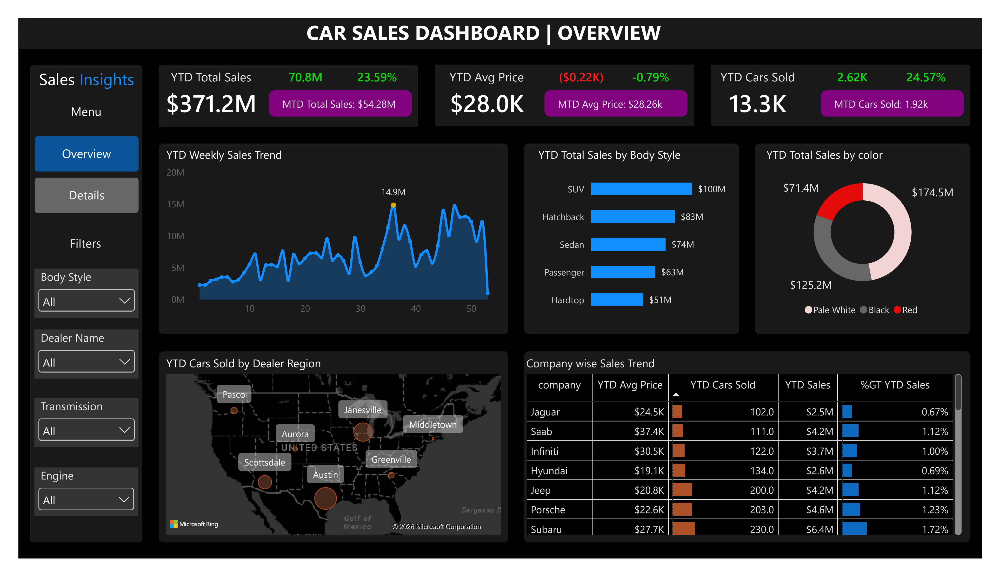
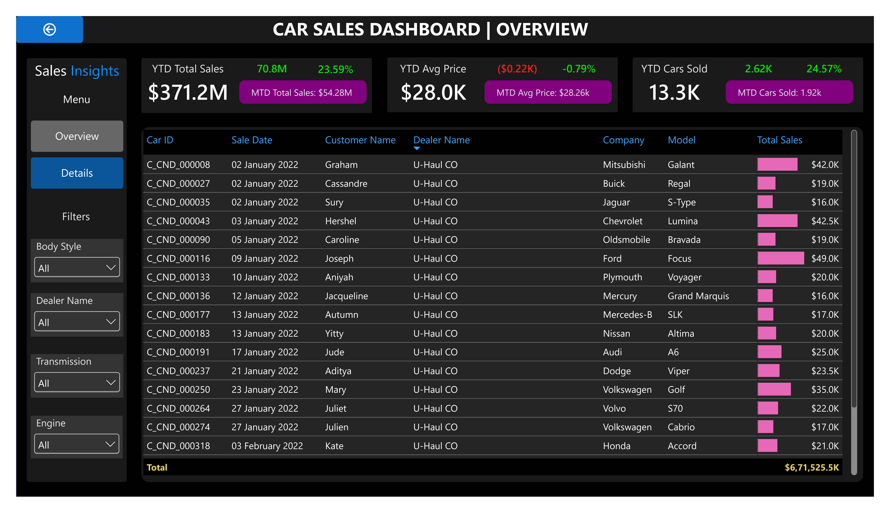

# 🚗 Car Sales Analysis

## 📌 Project Overview

This project analyzes **23,906 car sales records** to identify sales trends, customer purchasing patterns, vehicle preferences, dealer performance, and regional sales performance.

The analysis follows an end-to-end data analytics workflow using **SQL Server and Power BI**, covering data cleaning, validation, exploratory data analysis (EDA), data modeling, DAX calculations, and interactive dashboard development.

The goal is to transform raw car sales data into **actionable business insights** that can support sales, inventory, customer targeting, and dealer performance decisions.

---

## 🎯 Business Objectives

The project aims to answer key business questions such as:

- How are sales and units sold trending over time?
- What is the overall sales revenue, average selling price, and number of cars sold?
- Which car companies and models contribute the most to sales?
- Which body styles and colors generate the highest sales?
- Which dealer regions contribute the most to vehicle sales?
- How has sales performance changed year over year?
- How does average selling price change over time?
- Which vehicle and dealer segments represent opportunities for improving sales performance?

---

## 🗂️ Dataset

The dataset contains **23,906 car sales records** with information about:

| Category   | Columns                                                 |
| ---------- | ------------------------------------------------------- |
| Customer   | Customer Name, Gender, Annual Income, Phone             |
| Vehicle    | Company, Model, Engine, Transmission, Color, Body Style |
| Sales      | Sale Date, Price                                        |
| Dealer     | Dealer Name, Dealer Number, Dealer Region               |
| Identifier | Car ID                                                  |

---

## 🛠️ Tools & Technologies

* **SQL Server** — Data cleaning, validation, EDA, and analysis
* **Power BI** — Data modeling, DAX, visualization, and dashboard development
* **DAX** — KPI calculations, time intelligence, and YoY analysis
* **GitHub** — Project documentation and version control

---

# 🔄 Project Workflow

```text
Raw Car Sales Dataset
        ↓
Import CSV into SQL Server
        ↓
Data Quality Checks
        ↓
Data Cleaning
        ↓
Data Validation
        ↓
Exploratory Data Analysis (EDA)
        ↓
Data Modeling
        ↓
DAX Measures
        ↓
Power BI Dashboard
        ↓
Business Insights
        ↓
Recommendations
```

---

# 🧹 Data Cleaning & Validation

The raw dataset was imported into SQL Server and subjected to several data-quality checks.

### Data Quality Checks

* Checked total number of records
* Verified column names and data types
* Checked duplicate `car_id` values
* Checked NULL values
* Checked blank strings
* Checked leading and trailing spaces
* Checked numerical values for invalid or negative values
* Checked categorical values for inconsistencies
* Validated dealer number format
* Validated phone number values
* Checked date formatting

### Data Cleaning

The following transformations were performed:

* Removed unnecessary spaces from text fields
* Standardized date values
* Converted the sales date from text to the `DATE` data type
* Updated Engine Name(Remove extra `á` from Engine Column)
* Ensured appropriate data types for numerical and categorical fields
* Validated dealer number and phone number fields

---

# 📊 Exploratory Data Analysis

EDA was performed in SQL Server to understand the major patterns and relationships in the dataset.

### Sales Performance

* Total number of cars sold
* Total sales revenue
* Average selling price
* Average customer income


### Customer Analysis

* Sales by gender
* Customer income distribution
* Average income by gender


### Vehicle Analysis

* Sales by company
* Top-selling models
* Sales by body style
* Sales by transmission
* Sales by engine
* Sales by color
* Average price by company

### Dealer & Regional Analysis

* Top-performing dealers
* Bottom-Performing dealers
* Sales by dealer
* Sales by dealer region
* Average selling price by dealers
* Sales by Dealer Region

### Price Analysis

* MIN Price
* MAX Price
* Avg Price
* Avg Price by Company
* Avg Price by Body Style


### Time Analysis
* Yearly Sales Trends 
* Monthly sales trends
* Year-over-Year (YoY) sales growth


---

# 📈 Key SQL Analysis

The analysis included advanced SQL techniques such as:

* `GROUP BY`
* Aggregate functions
* `CASE` statements
* `DISTINCT`
* `HAVING`
* `CTE`
* Window functions
* `LAG()`
* `RANK()`
* Date functions
* `TRY_CONVERT()`
* Data validation queries

### Example: YoY Sales Growth

```sql
WITH yearly_sales AS (
    SELECT
        YEAR(sale_date) AS sale_year,
        COUNT(*) AS cars_sold,
        SUM(price) AS total_sales
    FROM car_sales
    GROUP BY YEAR(sale_date)
),
yoy_analysis AS (
    SELECT
        sale_year,
        cars_sold,
        total_sales,
        LAG(cars_sold) OVER (
            ORDER BY sale_year
        ) AS previous_year_cars,
        LAG(total_sales) OVER (
            ORDER BY sale_year
        ) AS previous_year_sales
    FROM yearly_sales
)
SELECT
    sale_year,
    cars_sold,
    total_sales,
    cars_sold - previous_year_cars AS unit_change,
    total_sales - previous_year_sales AS sales_change,
    ROUND(
        (total_sales - previous_year_sales) * 100.0
        / NULLIF(previous_year_sales, 0),
        2
    ) AS yoy_sales_growth_pct
FROM yoy_analysis
ORDER BY sale_year;
```

---

# 📊 Power BI Dashboard

The cleaned dataset was imported into Power BI to create an interactive sales analytics dashboard.

## Dashboard Pages

### 1. Overview

Provides a high-level view of overall business performance.

**KPIs:**

* YTD Total Sales
* Sales Difference
* YoY Sales Growth
* YTD Avg Price
* Avg Price Difference
* YoY Avg Price Growth
* YTD Cars Sold
* Cars Sold Diff
* YoY Cars Sold Growth

**Visuals:**

* Weekly Sales Trend(Area Chart)
* YTD Total Sales by Body Type(Bar Chart)
* YTD Total Sales by Color(Donut Chart)
* YTD Cars Sold by Dealer Region(Map Chart)
* Company wise Sales Trend(Table)

---

### 2. Details


**KPIs:**

* YTD Total Sales
* Sales Difference
* YoY Sales Growth
* YTD Avg Price
* Avg Price Difference
* YoY Avg Price Growth
* YTD Cars Sold
* Cars Sold Diff
* YoY Cars Sold Growth
  
**Visuals:**  

Details Grid: A transaction-level view containing Car ID, Sale Date, Customer Name, Dealer Name, Company, Model, and Sale Amount, with filtering options for detailed record-level analysis.


---

# 🧮 DAX Measures

Key Power BI measures include:

### Total Sales

```DAX
Total Sales =
SUM(car_sales[price])
```

### Cars Sold

```DAX
Cars Sold =
COUNT(car_sales[car_id])
```

### Average Selling Price

```DAX
Average Price =
AVERAGE(car_sales[price]) 
```

### YTD Total Sales

```DAX
YTD Total Sales = 
TOTALYTD(SUM(car_sales[price]), 'Date'[Date])
```

### Previous YTD Total Sales

```DAX
PYTD Total Sales = 
CALCULATE(SUM(car_sales[price]), SAMEPERIODLASTYEAR('Date'[Date]))
```
### Sales Difference

```DAX
Sales Difference = 
[YTD Total Sales] - [PYTD Total Sales]
```

### Sales Difference Color

```DAX
Sales Diff Color = 
IF([Sales Difference] > 0, "Green", "Red")
```

### YoY Sales Growth

```DAX
YoY Sales Growth = 
DIVIDE([Sales Difference], [PYTD Total Sales])
```

### MTD Total Sales

```DAX
MTD Total Sales = 
TOTALMTD(SUM(car_sales[price]), 'Date'[Date])
```
### MTD KPI(Formatted)
```DAX
MTD KPI = 
CONCATENATE("MTD Total Sales: ", FORMAT([MTD Total Sales] / 1000000, "$0.00M"))
```

and other measure like this

- YTD Avg Price
- PYTD Avg Price
- Avg Price Difference
- Avg Price Color(for color formatting)
- YoY Avg Price
- MTD Avg Price
- MTD Avg Price KPI
- YTD Cars Sold
- PYTD Cars Sold
- Cars Sold Difference
- Cars Sold Colo
- YoY Cars Sold
- MTD Cars Sold
- MTD Cars Sold KPI

### Max Point Area Chart(To highlight max data label in Area Chart)
```DAX
Max Point Area Chart = 
IF(MAXX(ALLSELECTED('Date'[Week]), [Total Sales]) = [Total Sales], MAXX(ALLSELECTED('Date'[Week]), [Total Sales]), BLANK())
```### 🔎 Interactive Features

- Year/date filtering
- Body Style filter
- Dealer Name filter
- Transmission filter
- Engine filter
- Overview and Details page navigation
- Interactive cross-filtering across visuals


---
## 🖼️ Dashboard Preview

### Overview



### Details




# 💡 Business Insights

1. **Strong Sales Growth:** YTD sales reached **$371.2M**, representing **23.59% growth** compared with the previous year.

2. **Volume-Driven Growth:** YTD cars sold increased by **24.57% to approximately 13.3K units**, while average selling price declined by **0.79% to approximately $28K**, indicating that sales growth is primarily driven by higher vehicle volume rather than higher prices.

3. **SUVs Lead Revenue:** SUVs generated approximately **$100M in YTD sales**, followed by Hatchbacks at **$83M** and Sedans at **$74M**, making SUVs the leading revenue-generating body style.

4. **Pale White Leads by Revenue:** Pale White generated approximately **$174.5M in sales**, followed by Black at **$125.2M** and Red at **$71.4M**, making Pale White the highest-revenue color.

5. **Weekly Sales Volatility:** Weekly sales show significant fluctuations throughout the selected period, with the highest highlighted week generating approximately **$14.9M**.

6. **Dealer and Company Performance Varies:** The company-level and dealer-level analysis shows differences in sales volume, average selling price, and revenue contribution, providing opportunities to identify high-performing segments and areas requiring improvement. 


---

# 🎯 Business Recommendations

1. **Prioritize High-Performing Body Styles:** Maintain strong inventory availability for SUVs and other high-performing body styles based on sales performance.

2. **Optimize Inventory by Color:** Maintain adequate inventory of high-revenue colors such as Pale White and Black while monitoring lower-performing colors.

3. **Increase Average Transaction Value:** Since unit growth is stronger than revenue growth and average selling price has declined slightly, explore premium models, upgrades, and targeted upselling opportunities.

4. **Investigate Sales Volatility:** Analyze high- and low-performing weeks to identify the impact of promotions, inventory availability, seasonality, and dealer activity.

5. **Benchmark Dealer Performance:** Identify high-performing dealers and analyze their product mix, sales volume, and average transaction value to identify practices that could be replicated elsewhere.

6. **Strengthen Regional Strategy:** Use regional sales performance to optimize inventory allocation and marketing efforts across stronger and weaker markets.


---

# 🧠 Skills Demonstrated

### SQL

* Data cleaning
* Data validation
* Data profiling
* Aggregations
* CTEs
* Window functions
* Ranking
* Date analysis
* YoY analysis
* Business-oriented SQL analysis

### Power BI

* Data modeling
* Date table creation
* DAX measures
* Time intelligence
* KPI design
* Interactive dashboards
* Slicers and filters
* Navigational Button
* Business storytelling

### Analytical Skills

* Exploratory Data Analysis
* Trend analysis
* Performance analysis
* Regional analysis
* Business insights
* Data-driven recommendations

---

# 🚀 Conclusion

This project demonstrates an end-to-end approach to analyzing car sales data, starting from raw data ingestion and quality validation through SQL-based analysis and Power BI visualization.

The analysis transforms raw transactional data into meaningful insights around **sales performance, customer behavior, vehicle preferences, dealer performance, and regional trends**, helping demonstrate how data can support business decision-making.
